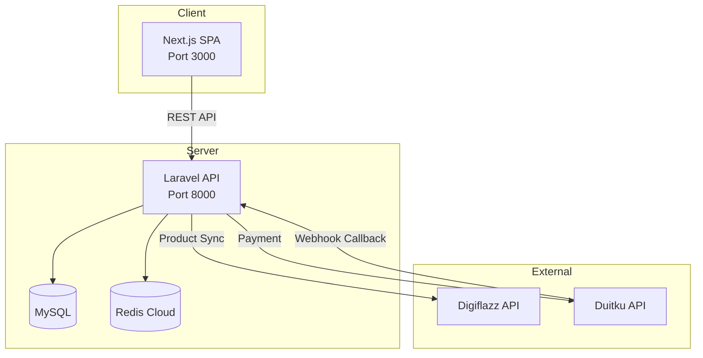
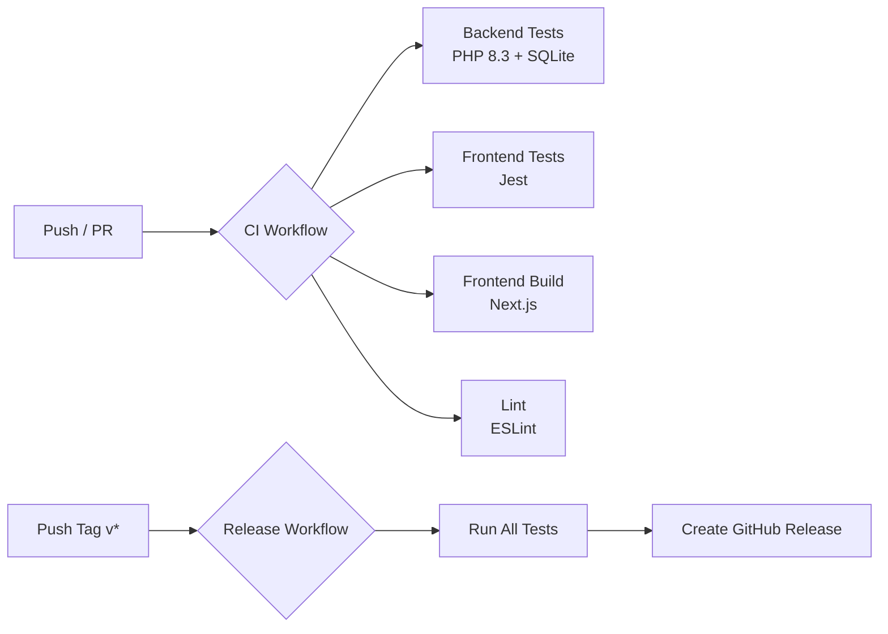
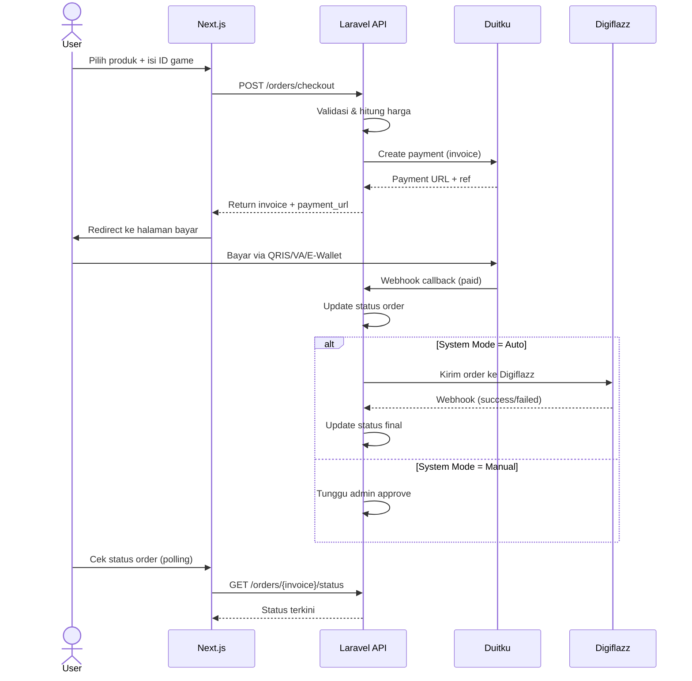
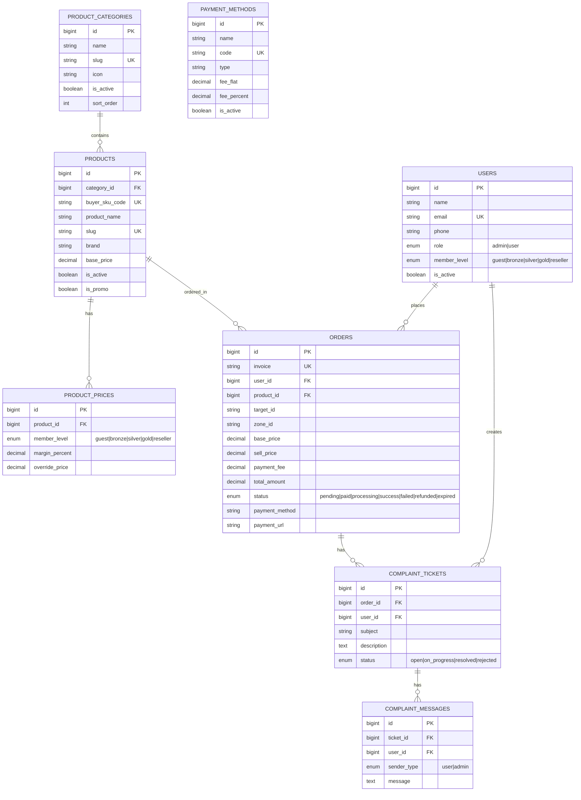

# 🎮 TamsHub Store — Top Up Game & Online Service

Platform top-up game dan layanan digital dengan integrasi **Digiflazz** (provider produk) dan **Duitku** (payment gateway). Dibangun dengan arsitektur **Laravel API + Next.js SPA**.


---

## 📑 Daftar Isi

- [Arsitektur](#-arsitektur)
- [Tech Stack](#-tech-stack)
- [Fitur Utama](#-fitur-utama)
- [Struktur Proyek](#-struktur-proyek)
- [Instalasi & Setup](#-instalasi--setup)
- [Environment Variables](#-environment-variables)
- [API Endpoints](#-api-endpoints)
- [Testing](#-testing)
- [CI/CD Pipeline](#-cicd-pipeline)
- [Alur Checkout](#-alur-checkout)
- [Database Schema](#-database-schema)

---

## 🏗 Arsitektur



---

## 🛠 Tech Stack

| Layer | Teknologi |
|-------|-----------|
| **Backend** | Laravel 12, PHP 8.3, Sanctum Auth, Pest Testing |
| **Frontend** | Next.js 16, React 19, TypeScript 5, Tailwind CSS 4 |
| **Database** | MySQL 8 (prod), SQLite :memory: (test) |
| **Cache/Queue** | Redis Cloud, Laravel Queue |
| **Payment** | Duitku Payment Gateway (QRIS, VA, E-Wallet) |
| **Product Provider** | Digiflazz API (game voucher, pulsa, token PLN) |
| **State Management** | Zustand (client), React Query (server) |
| **Animasi** | React Bits (ShuffleText, FuzzyText, CountUp, ClickSpark, LaserFlow, PixelBlast, ElectricBorder) |
| **CI/CD** | GitHub Actions |

---

## ✨ Fitur Utama

### Publik
- 🎮 Katalog produk dengan kategori & pencarian real-time
- 🛒 3-step checkout flow (pilih produk → isi ID → bayar)
- 💳 Multiple payment methods (QRIS, Virtual Account, E-Wallet)
- 📊 Cek status order real-time dengan auto-polling
- 🏆 Leaderboard top spender (harian/mingguan/bulanan)
- 📱 Responsive mobile-first design
- 🌙 Dark theme dengan animasi React Bits

### Member
- 🔐 Register & login dengan Sanctum token auth
- 📋 Riwayat transaksi
- 📨 Sistem komplain dengan tiket support
- 💎 Multi-level pricing (Guest/Bronze/Silver/Gold/Reseller)

### Admin Dashboard
- 📊 Dashboard statistik (pendapatan, order, produk, tiket)
- 📦 Manajemen produk dengan sync Digiflazz
- 📋 Manajemen order (approve manual, retry failed)
- 👥 Manajemen user (aktivasi, ganti level)
- 💬 Manajemen komplain (reply, close tiket)
- ⚙️ Site settings, slider, payment methods
- 🔄 System mode (otomatis/manual/maintenance)

---

## 📂 Struktur Proyek

```
tamshub-store/
├── .github/workflows/       # CI/CD pipeline
│   ├── ci.yml               # Test & build on push/PR
│   └── release.yml          # Release on tag
├── backend/                 # Laravel 12 API
│   ├── app/
│   │   ├── Console/         # Artisan commands
│   │   ├── Http/
│   │   │   ├── Controllers/ # API controllers (v1 + admin)
│   │   │   ├── Middleware/  # Admin middleware
│   │   │   └── Requests/   # Form requests
│   │   ├── Jobs/            # Queue jobs
│   │   ├── Models/          # Eloquent models
│   │   └── Services/        # Business logic
│   ├── database/
│   │   ├── migrations/      # 15 migration files
│   │   ├── factories/       # User factory
│   │   └── seeders/         # Demo data seeder
│   ├── routes/api.php       # API route definitions
│   └── tests/               # Pest tests (36 tests)
├── frontend/                # Next.js 16 SPA
│   ├── src/
│   │   ├── app/             # App Router pages
│   │   │   ├── admin/       # Admin dashboard (6 pages)
│   │   │   ├── products/    # Product listing & detail
│   │   │   ├── order/       # Order status page
│   │   │   ├── login/       # Auth pages
│   │   │   └── ...
│   │   ├── components/
│   │   │   ├── effects/     # React Bits animations (7)
│   │   │   ├── layout/      # Navbar, Footer, FloatingChat
│   │   │   └── ui/          # Button, Input, Loading, etc.
│   │   ├── hooks/           # React Query hooks
│   │   ├── lib/             # API client & utilities
│   │   ├── store/           # Zustand auth store
│   │   └── types/           # TypeScript interfaces
│   └── __tests__/           # Jest tests (54 tests)
└── README.md
```

---

## 🚀 Instalasi & Setup

### Prerequisites

- PHP 8.3+ dengan extension: `pdo_mysql`, `redis`, `mbstring`
- Composer 2.x
- Node.js 22+ & npm 10+
- MySQL 8
- Redis (lokal atau cloud)

### 1. Clone Repository

```bash
git clone https://github.com/el-pablos/tamshub-store.git
cd tamshub-store
```

### 2. Setup Backend

```bash
cd backend
composer install
cp .env.example .env
php artisan key:generate
```

Edit `.env` dan sesuaikan konfigurasi database, Redis, Digiflazz, dan Duitku.

```bash
php artisan migrate --seed
php artisan serve
```

### 3. Setup Frontend

```bash
cd frontend
npm install
cp .env.example .env.local
npm run dev
```

### 4. Akun Default (dari seeder)

| Email | Password | Role |
|-------|----------|------|
| `admin@tamshub.com` | `password` | Admin |
| `user@tamshub.com` | `password` | User (Guest) |

---

## 🔐 Environment Variables

### Backend (`backend/.env`)

| Variable | Deskripsi |
|----------|-----------|
| `DB_DATABASE` | Nama database MySQL |
| `DB_USERNAME` / `DB_PASSWORD` | Kredensial MySQL |
| `REDIS_HOST` / `REDIS_PORT` | Koneksi Redis |
| `REDIS_PASSWORD` | Password Redis (jika cloud) |
| `DIGIFLAZZ_USERNAME` | Username akun Digiflazz |
| `DIGIFLAZZ_API_KEY` | API key Digiflazz |
| `DUITKU_MERCHANT_CODE` | Kode merchant Duitku |
| `DUITKU_API_KEY` | API key Duitku |
| `DUITKU_CALLBACK_URL` | URL callback untuk webhook |
| `SYSTEM_MODE` | `auto` / `manual` / `maintenance` |

### Frontend (`frontend/.env.local`)

| Variable | Deskripsi |
|----------|-----------|
| `NEXT_PUBLIC_API_URL` | URL backend API (e.g. `http://localhost:8000/api/v1`) |

---

## 📡 API Endpoints

### Public

| Method | Endpoint | Deskripsi |
|--------|----------|-----------|
| `GET` | `/api/v1/products` | List produk (search, filter, pagination) |
| `GET` | `/api/v1/products/{slug}` | Detail produk + pricing |
| `GET` | `/api/v1/categories` | List kategori produk |
| `POST` | `/api/v1/orders/checkout` | Buat order baru |
| `GET` | `/api/v1/orders/{invoice}/status` | Cek status order |
| `GET` | `/api/v1/payment/methods` | List metode pembayaran |
| `GET` | `/api/v1/leaderboard` | Leaderboard top spender |
| `GET` | `/api/v1/site/settings` | Pengaturan situs |
| `GET` | `/api/v1/site/sliders` | Slider/banner |

### Auth

| Method | Endpoint | Deskripsi |
|--------|----------|-----------|
| `POST` | `/api/v1/auth/register` | Registrasi user baru |
| `POST` | `/api/v1/auth/login` | Login |
| `POST` | `/api/v1/auth/logout` | Logout (auth required) |
| `GET` | `/api/v1/auth/me` | Profile user (auth required) |

### Member (Auth Required)

| Method | Endpoint | Deskripsi |
|--------|----------|-----------|
| `GET` | `/api/v1/orders/history` | Riwayat order user |
| `POST` | `/api/v1/orders/{id}/complaint` | Buat tiket komplain |

### Admin (Admin Only)

| Method | Endpoint | Deskripsi |
|--------|----------|-----------|
| `GET` | `/api/v1/admin/dashboard/stats` | Statistik dashboard |
| `GET` | `/api/v1/admin/orders` | List semua order |
| `POST` | `/api/v1/admin/orders/{id}/approve` | Approve order manual |
| `POST` | `/api/v1/admin/orders/{id}/retry` | Retry order gagal |
| `GET` | `/api/v1/admin/products` | List semua produk |
| `POST` | `/api/v1/admin/products/sync` | Sync produk dari Digiflazz |
| `GET` | `/api/v1/admin/users` | List semua user |
| `GET` | `/api/v1/admin/complaints` | List tiket komplain |
| `POST` | `/api/v1/admin/complaints/{id}/reply` | Reply tiket |
| `GET` | `/api/v1/admin/settings/site` | Get site settings |
| `PUT` | `/api/v1/admin/settings/site` | Update site settings |

---

## 🧪 Testing

### Backend (Pest - 36 tests)

```bash
cd backend
php artisan test
```

Cakupan test:
- **Unit**: PricingService (kalkulasi harga per level)
- **Feature Auth**: Register, login, logout, profile, guard
- **Feature Product**: List, detail, categories, search, filter
- **Feature Order**: Checkout validation, order status, history
- **Feature Admin**: Dashboard, CRUD, settings, access control
- **Feature Complaint**: Submit complaint, validation, auth guard
- **Feature Misc**: Leaderboard, site settings

### Frontend (Jest - 54 tests)

```bash
cd frontend
npm test
```

Cakupan test:
- **UI Components**: Button, Input, Loading, ErrorState, StatusBadge
- **Utilities**: formatCurrency, getStatusColor, getStatusLabel, censorText
- **Auth Store**: Zustand store (setAuth, logout, loadFromStorage)

---

## 🔄 CI/CD Pipeline



**CI** berjalan pada setiap push ke `main`/`develop` dan pull request ke `main`.
**Release** berjalan otomatis saat push tag `v*` (contoh: `v1.0.0`).

---

## 🛒 Alur Checkout



---

## 🗄 Database Schema



---

## 📄 Lisensi

Private repository — hak cipta dilindungi.

---

<p align="center">
  Dibuat dengan ❤️ oleh <strong>TamsHub Team</strong>
</p>
